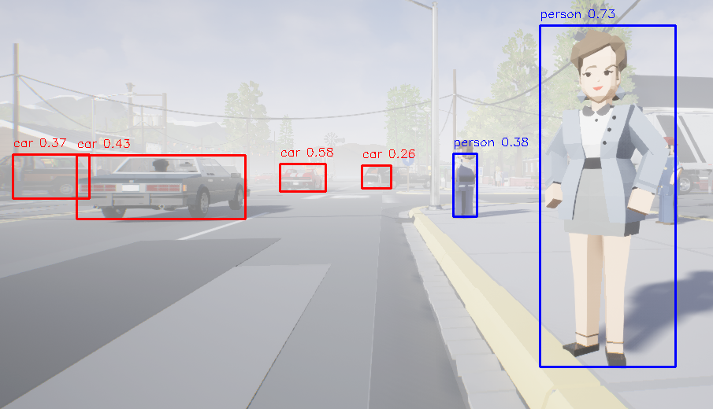
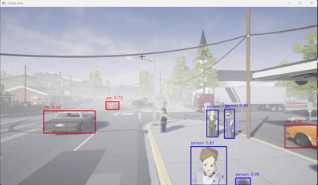

# AirSim Drone Object Detection Simulation in Unreal Engine 4.27
This simulation is an implementation of an autonomous drone using AirSim in the Unreal Engine environment, capable of detecting objects such as cars, people, trees, and more. This project is suitable for research in computer vision, machine learning, and the development of autonomous drone navigation systems
## 🎯 Main Features
- 🚁 Drone simulation using AirSim with Unreal Engine
- 🔍 Real-time object detection (cars, people, trees, etc.)
- 🎥 Drone camera streaming (FPV)
- 🧠 Can be extended for AI/Deep Learning integration (YOLO, SSD, etc.)
- 💾 Flight data logging and detection result visualization

## 🛠️ Requirements
Before running this project, make sure your system has:

- [Unreal Engine 4.27+](https://www.unrealengine.com/)
- [AirSim](https://github.com/microsoft/AirSim)
- Python 3.7+
- OpenCV for Python
- Microsoft visual studio 22
- Desktop development with C++ 
- NET Framework SDK
- YOLOv5, or any model.


## Installation
How to install:

- Download & Install [Epic Games Launcher](https://store.epicgames.com/it/download), [Unreal Engine 4.27](https://docs.unrealengine.com/4.27/en-US/Basics/InstallingUnrealEngine/), [AirSim Package](https://microsoft.github.io/AirSim/)
- For integration and compiling steps, follow the [AirSim guidebook](https://microsoft.github.io/AirSim/build_windows)
- Save the ```setting.json``` file to **C:\Users\user\Documents\AirSim**
- Download the ```AirSimTest01.zip``` file and extract to **C:\Users\user\Documents\Unreal Project\AirSimTest01**
- Right-click on AirSimTest01.uproject file in the AirSimTest01 folder and select Generate Visual Studio project files to compile the project with the new files.
- Open ```AirSimTest01.sln```, set the debugger to "Debug Game Editor" and platform to "Win64", then start the project
- file ```setting.json``` is a place for properties such as vehicle types, cameras, sensors, and others.
- ".umap" files are map files — you can change them based on which environment you want to use
- To control the drone, I'm using [PX4-autopilot](https://github.com/PX4/PX4-Autopilot)
- Object detection here uses YOLOv5 from Ultralytics based on a pretrained model with `car` and `person` as the target classes. Once the simulation environment is ready, run the `detect.py` script. A pop-up window will display the drone's front camera view titled "FrontCenterRGB".

## PX4-Autopilot Command List

There are basic commands that can be used in drone simulation in unreal using [PX4-autopilot](https://github.com/PX4/PX4-Autopilot). For complete commands can be seen from [dokumentasi PX4](https://docs.px4.io/main/en/).

| Command | Function |
| ------ | ------ |
| commander arm | Mengaktifkan Motor |
| commander disarm | Menonaktifkan Motor |
| commander takeoff | Lepas landas (terbang) |
| commander land | mendarat otomatis |
| commander mode offboard | Mode offboard (kontrol dari AirSim/script MAVSDK) |
| commander mode position | Mode position control |

## Screenshoot and Video


